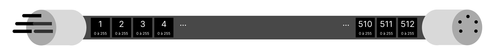
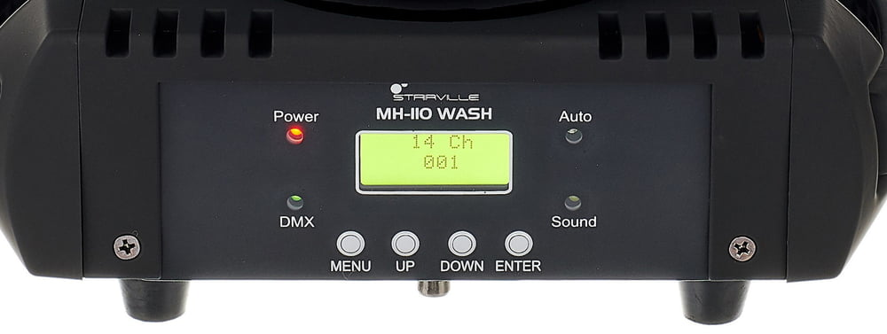
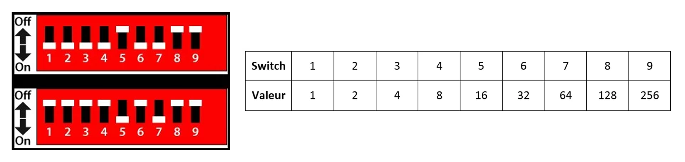
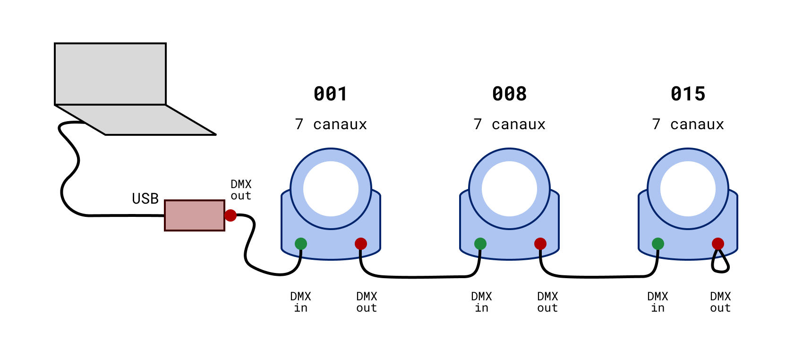
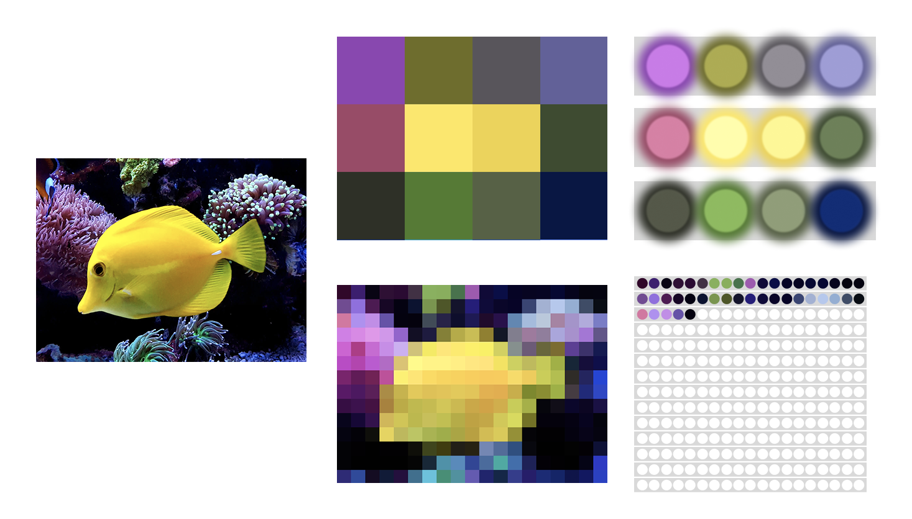
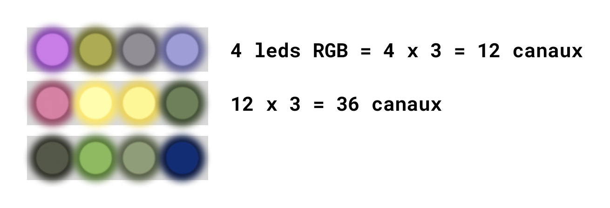
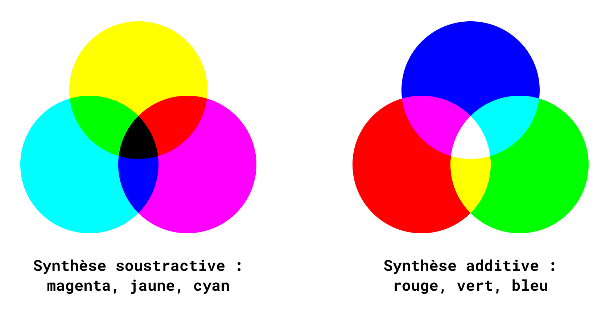
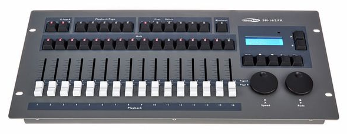
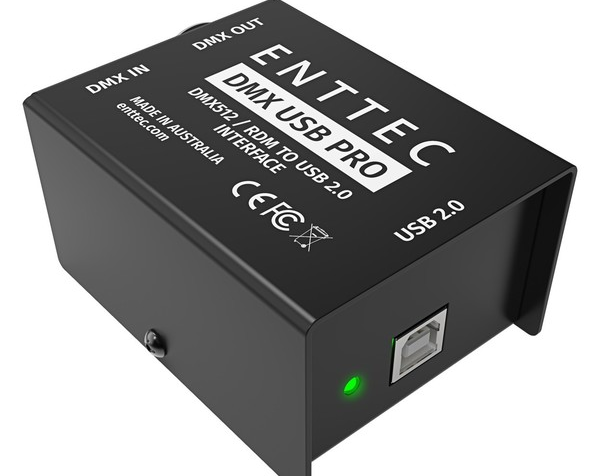

# DMX Lights !

# 1. DMX ??

On contrôle la lumière en DMX, une norme de transmission de données qui permet de contrôler 512 canaux (ou channels) avec des valeurs de 0 à 255. On appelle "univers DMX" une ligne de 512 canaux, et on peux parfois contrôler plusieurs univers simultanément pour contrôler plusieurs lignes de 512 canaux.

Il y a donc un seul controleur (un pupitre lumière ou un logiciel) et un nombre illimité de récepteurs (les projecteurs), qui constituent un réseau avec un seul câble, où chaque récepteur transmet les données au suivant.

DMX c'est donc un protocole de communication, mais aussi une norme de câble : un câble supporte donc 512 canaux. On utilise en général des câbles XLR 5 ou 3 branches.

*Un câble XLR 5 branches...*

*512 canaux avec des valeurs de 0 à 255...*

# 2. Channels

Chaque projecteur a un nombre de channels différents, et les channels contrôlent différents éléments.
Il y a souvent différents modes permettant de choisir le nombre de channel DMX (et donc le nombre d'éléments controlés).

Par exemple, une lyre movo beam comme celles de la salle fond vert a 4 modes :
- 5 channels
- 16 channels
- 21 channels
- 36 channels

Dans le mode 5 channels, on contrôle le dimmer (intensité de la lumière), le strobe (clignotement), le zoom (faisceau), un mode Auto Program, et la vitesse de déplacement de la tête de lyre.

Chaque projecteur est fournit avec une documentation qui nous permet de savoir combien de mode DMX il y a, et la "control table" de chacun des modes.

Dans la Control Table, il y a la fonction de chaque channel, et la manière dont la valeur envoyée sur le channel contrôle le paramètre.

*Page de documentation de nos lyres Movo Beam...*

Ici par exemple, le channel 1 et la valeur reçue de 0 à 255 opère le dimmer entre 0% et 100%.

Le channel 2 et la valeur reçue entre 0 et 6 ouvre le strobe, tandis qu'une valeur entre 6 et 255 influe sur la vitesse du strobe.

# 3. Adressage et branchements

Chaque projecteur a son adresse propre : on branche les projecteurs en série avec des câbles DMX (XLR) et on les adresse en fonction du nombre de canaux qu'ils utilisent.

Chaque projecteur reçoit donc les 512 informations DMX et choisit quels canaux lui sont destinés à partir de son adresse.

## 3.1 Interface et dipswitch

L'adresse DMX du projecteur est configurée directement sur l'interface du projecteur sur les projecteurs récents.

*Ici le mode est 14 caneaux et l'adresse est 001...*

Sur les projecteurs plus anciens, il y a des "dip switchs", qui permettent d'entrer l'adresse de manière physique, en binaire : le switch en haut est 0 et le switch en bas est 1. 

Pour simplifier, on calcule l'adresse avec un tableau, ou on sait que la valeur de chaque switch est le double du précédent :

*Exemple dipswitchs et tableau des valeurs en binaire...*

Ici l'adresse du premier dipswitch est donc `1 + 2 + 4 + 8 + 32 + 64 = 111` (111101100 en binaire) et l'adresse du second dipswitch est `16 + 64 = 80` (000010100 en binaire).

## 3.2 Choisir l'adresse

En général on adresse en série : 
- adresse projecteur 1 = 1
- adresse projecteur 2 = adresse projecteur 1 + nombre de canaux projecteur 1
- adresse projecteur 3 = adresse projecteur 2 + nombre de canaux projecteur 2
- et ainsi de suite...

Par exemple, on branche deux projecteurs RGB utilisant 3 canaux chacun (R, G et B) en série, on pourra adresser le premier projecteur avec la plage d'adresses allant de 1 à 3 et le second de 4 à 6. On utilise ainsi 6 canaux :

- 1 : R premier projecteur
- 2 : G premier projecteur
- 3 : B premier projecteur
- 4 : R second projecteur
- 5 : G second projecteur
- 6 : B second projecteur

On peux ensuite brancher d'autres projecteurs en série en continuant l'adressage selon le nombre de canaux utilisés par chaque projecteur, ou on peux aussi sauter des canaux, pour commencer les adresses sur des dizaines à chaque fois par exemple.

*Un réseau DMX simple...*

# 4. Pixel Mapping

Le principe du pixel mapping, c'est d'appliquer les couleurs d'un pixel d'un image aux couleurs d'un projecteur ou d'une led sur une barre de led.

On utilise en général plusieurs barres ou rubans de leds, et on utilise donc une image ou une vidéo comme contrôle de lumières.

C'est un peu comme si on avait un écran très basse définition, les leds étant beaucoup + grosses que des pixels.

*Pixel mapper une photo de poisson...*

Le principe de la lumière (et des écrans aussi) c'est la synthèse additive, contrairement à l'imprimerie qui marche avec la synthèse soustractive. On arrive donc au noir en éteignant le R G et B, et au blanc en allumant le R G B.

Certains projecteurs ont aussi du blanc (W), parce que le blanc créé par les leds RGB n'est pas aussi beau que la led blanche, et ça permet d'avoir des couleurs pastels plus belles.

*Pixel mapper une photo de poisson...*

En général, il y a beaucoup de leds par barre, et 3 (RGB) ou 4 (RGBW) canaux par leds. 

*La synthèse soustractive et additive...*

Pour aller plus loin : [le process avec Madmapper](https://github.com/LucieMrc/Madmapper_PixelMapping).

# 5. Contrôle DMX

Pour contrôler les projecteurs, il faut donc envoyer des données : soit à partir d'une console lumière, soit en usb avec un ordinateur.

*Une console lumière random...*

Il y a pleins de types de consoles lumières, et parfois des logiciels qui vont avec. On en a pas à l'ateliernum.

*Un boîtier usb <-> DMX...*

Avec un boîtier USB, on peux recevoir et envoyer des données DMX sur un ordinateur, avec le logiciel de notre choix.

Il suffit de faire un patch, c'est à dire assigner des adresses DMX à des commandes dans le logiciel.

## 5.2 Chataigne

Chataigne ([ma documentation](https://github.com/LucieMrc/Chataigne_2spi)) est un logiciel qui permet de créer des interactions entre différents protocoles de communication.

On peux ainsi faire l'interface par exemple entre des touchdes du clavier et des données DMX (si j'appuie sur "A" tout s'allume, si j'appuie sur "B" on change de couleurs, etc), ou tout simplement envoyer des données DMX à travers l'interface de Chataigne directement.

Le [tutoriel et du patch des lyres de la salle fond vert](https://github.com/LucieMrc/SalleFondVert_Controller).

## 5.3 Madmapper

## 5.4 Touchdesigner

# 5. Interaction

# 5.1 MIDI

# 5.2 Arduino

# 5.2 Mediapipe

